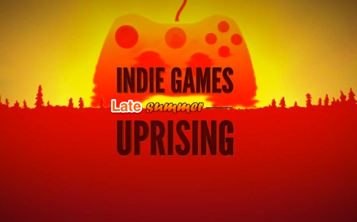

# Indie Game Recommender

A recommendation engine to help main stream video gamers discover games created by independent individuals or small groups.



Before I go into the motivation, the data, and the modeling process, I would like to explain verbally and visually the file structure of this repo.

## Repo Structure

The Capstone project repo is divided into three sub-directories:

```
.
|-- App
|   |___app.py
|   |___model.py
|   |   |___gensim_files
|   |___getGameName.py
|   |___static
|   |___templates
|-- GetData
|   |___getMongoDBMetacritic.py
|   |___getMongoDBIndie.py
|-- Recommender
|   |___getCorpus.py
|   |   |___IndieSummaries.dict
|   |   |___IndieSummaries.mm
|   |   |___IndieSummaries.mm.index
|   |___model.py
|   |   |___model_indie.lsi
|   |   |___model_indie.lsi.projection
```


1. `App`:This directory has the actual application written in Flask and Jinja that runs on www.indiegamerpro.com. This directory contains the `model.py` and `app.py` and `getGameName.py`. The `app.py` runs the Flask application. `getGameName.py` takes the user-inputThe `model.py` recommends a game based on user input while 
2. `GetData`: This directory has two python files. The `getMongoDBMetacritic.py` and `getMongoDBIndiedb.py`. Both of these files are web scrapers. They scrape the www.metacritic.com and www.indiedb.com websites for game information such as summaries, genre, title, platform, and more.
3. `Recommender`: This subdirectory contains two main files, `getCorpus.py` and `model.py`. The python program `getCopus.py` creates a corpus or bag-of-words from all of the ~1500 indie games. It has other files such as the dictionary, index file and the model file.

The `model.py` file contains the LSI model that is created using the Latent Semantic Analysis. The LSA uses singular matrix decomposition or SVD and therefore generates two files such as `model_indie.lsi` and `model_indie.lsi.projection`.

## Motivation

Ubisoft, Activision, and Electronic Arts are few of the biggest players that dominate the video gaming scene. They have huge resources to create and develop games, deep financial pockets to support development of multiple games, and a large advertising budget to market their products. In contrast video games created by individuals or small groups, called Indie games, are often incredibly additive, visually appealing, and have great game play. However, they lack the financial support and advertisement budget to make their games popular and compete with the biggest players.

Steam, an internet-based digital distribution platform, is the most popular site to purchase video games created for PC, Mac, and Linux. They have around 2000 Indie Games. However, their recommendation engine will generally recommends games created by the same company and of the same genre. Most recommendation systems do that. However, it would be good if they could recommend games outside of the genre.

I created a recommender system to address the issue of unbalanced Indie Gaming market and create a recommender system that recommends games not just within the genre but also outside of it.

## Getting Started