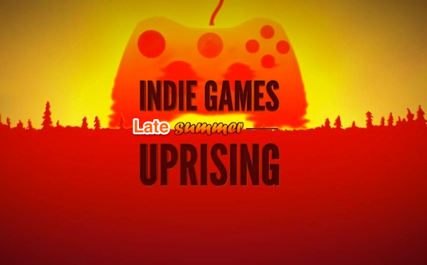
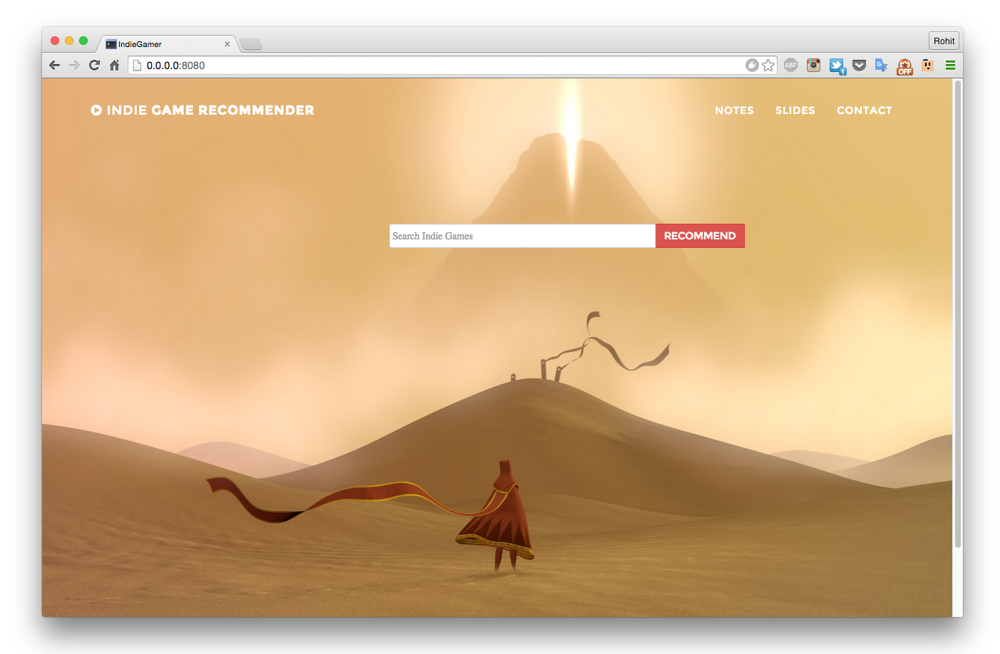
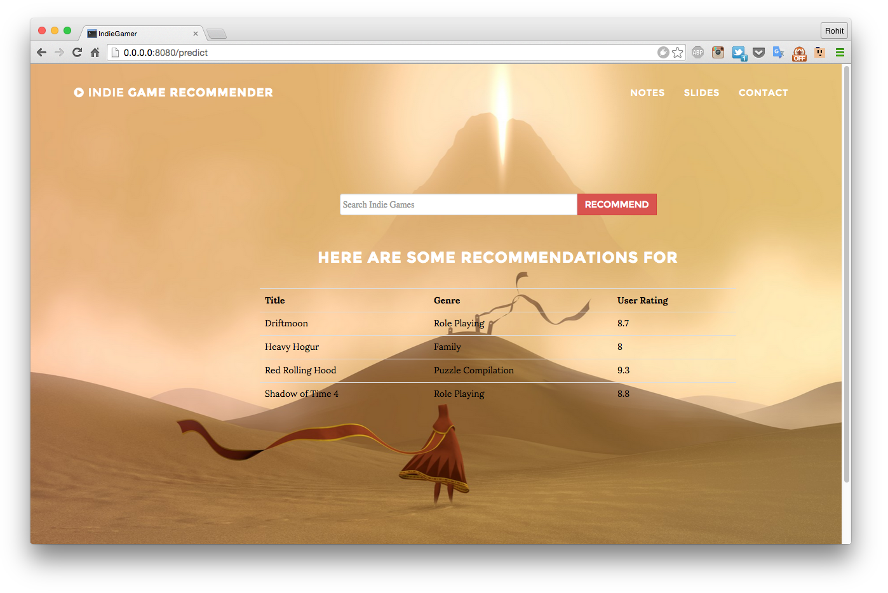

# Indie Game Recommender

www.indiegamerpro.com

A recommendation engine to help main stream video gamers discover games created by independent individuals or small groups.
<br>
<br>

<br>
<br>
Before I go into the motivation, the data, and the modeling process, I would like to explain verbally and visually the directory structure of this repo.

## Repo Structure

The Capstone project repo is divided into three main directories: App, GetData, and Recommender.

```
.
├── App
|   ├── app.py
|   ├── model.py
|   |   └── gensim_files
|   ├── getGameName.py
|   ├── static
|   └── templates
├── GetData
|   ├── getMongoDBMetacritic.py
|   └── getMongoDBIndie.py
├── Recommender
|   ├──getCorpus.py
|   |   ├── IndieSummaries.dict
|   |   ├── IndieSummaries.mm
|   |   └── IndieSummaries.mm.index
|   └── model.py
|   |   ├── model_indie.lsi
|   |   └── model_indie.lsi.projection
```


1. **`App`**: This directory has the actual web application written in Flask and Jinja that runs on www.indiegamerpro.com. This directory contains the program files `model.py`, `app.py`, and `getGameName.py`. The `app.py` runs the Flask application, `getGameName.py` takes the user-input, cleans and converts it to a format that is used by the model to search the game and its summary. The `model.py` recommends a game based on user input.
2. **`GetData`**: This directory has two python files, `getMongoDBMetacritic.py` and `getMongoDBIndiedb.py`. Both files are web scrapers. They scrape the www.metacritic.com and www.indiedb.com websites, respectively. Both files scrape game information such as summaries, genre, title, platform, release date, and user ratings.
3. **`Recommender`**: This directory contains two main files, `getCorpus.py` and `model.py`. The python program `getCorpus.py` creates a corpus or bag-of-words from all of the ~1500 indie games. It has other files such as the dictionary, index file, and the model file.

The `model.py` file contains the Latent Semantic Indexing (LSI) model that is created using the Latent Semantic Analysis. The LSA uses singular matrix decomposition (SVD) and therefore generates two files such as `model_indie.lsi` and `model_indie.lsi.projection`.

## Motivation

Ubisoft, Activision, and Electronic Arts are few of the biggest players that dominate the video gaming industry. They have huge resources to create and develop games, deep financial pockets to support development of multiple games, and a large advertising budget to market their products. In contrast video games created by individuals or small groups, called Indie games, are often incredibly additive, visually appealing, and have great game play. However, they lack the financial support and advertisement budget to make their games popular, reach the masses, and compete with the biggest players.

Steam, an internet-based digital distribution platform, is the most popular site to purchase video games created for PC, Mac, and Linux. They have ~2000 Indie Games, a relatively small collection of games as they charge developers a premium to advertise their games on Steam. Furthermore, their recommendation engine generally recommends games of the same genre as that the user has selected. Most recommendation systems do just that. However, such a process prevents the user from trying out games from different genre which can often result in the loss of revenue.

I created a recommender system to address the issues discussed above. My recommender system gets to the heart of the problem by targeting the consumers themselves. The recommender system invites a user to enter the name of the game they enjoy and returns a list of Indie games they are most likely to enjoy. The recommender systems does this like a pro by taking latent features from user-queried game, matches it with other Indie games across genres and returns Indie games that are most similar to user-queried game. Hence, a user is most likely to try out an Indie game and enjoy it as it is similar to the game the user enjoys and furthermore, the user is able to explore other genres without being disappointed.

## Data Acquisition

The first steps involved acquiring data for the project. I collected ~3000 most popular games by searching online for games from 2000 to 2015. The list was created by adding the names I searched online and the games I have myself played and know of.

The next step involved finding indie games. First I searched on Steam and found ~2000 indie games. However, a search online revealed a website called www.indiedb.com. This website had 13,700 indie games. Hence, this became my source for Indie games.

Finally, I used metacritic to get summaries and other information of popular games. I used metacritic over Steam because Steam poses a challenge to scrape. I found that pagination does not work on Steam, e.g., the scrapper is unable to move to the next page as the ping to the site resets the page counter to 1. This element is set intentionally by Steam to prevent scrapping.

Metacritic also posed a challenge initially as it rejected the ping from my scrapper. The rejected was a result of anti-scrapping function set by Metacritic.com. The website recognizes python's library `urllib2` and therefore return a `forbidden error`. The work-around was fairly straight-forward. I had to set few parameters in my scrapper that help it to mask itself as a Mozilla browser. After which I was able to scrape ~3000 pages fairly easily.

Indiedb.com did not pose such a problem. It was quite easy to scrape. However, the webpages are not consistent in their HTML structure. Furthermore, there seems a trend to embed the summary of the game in an image. This made scrapping of the latest games impossible. However, only handful of the cases suffered from this. The major hurdle was the fact that a lot of games were unrated by users. Here's a summary of what I found on www.indiedb.com:

```
    13,422 games in indiedb.com
      9163 games work for either Windows, Mac, or Linux
      4353 games rated by at least one person
```

Both scrappers dump their data in MongoDB databases. The database was called Games while the collections (tables) were called ``IndieGames`` and ``PopularGames``.

## Recommender Model

Before creating a model for the recommender system, I had to clean the data. Data cleaning involved removing ```unicode``` characters, urls, email addresses, and other funky characters. The data cleaning was performed as part of creating the corpus of indie games.

The creation of the indie games summary corpus involved **tokenization**, removal of **stop words**, and **lemmitization**. Finally, I applied the **term frequency-inverse document frequency** to the entire corpus. I also created a dictionary of words that go into the model.

I employed Latent Semantic Analysis (LSA) model for calculating the latent features in the indie games corpus. LSA produces a set of latent features between the documents and terms by analyzing relationships between a set of documents and the terms they contain.

The model then matches the vectorized summary of user input game and recommends indie games to the user.

## The Final Product

The final product is a web app. I tried to create a minimalistic yet artistic design that is welcoming to a user. The main page contains just a search bar into which the user types the game.

Here's the input page:



The product returns four recommended games:



## Future Work

I would like to try out other models for my recommender such as Doc2Vec and LDA. I believe these two models may result is better recommendations than the current LSA model. Need to add more here.
